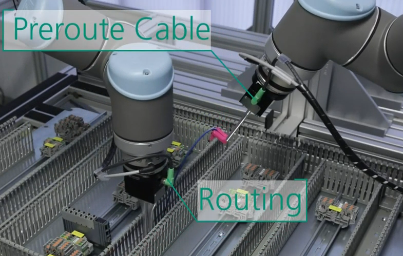
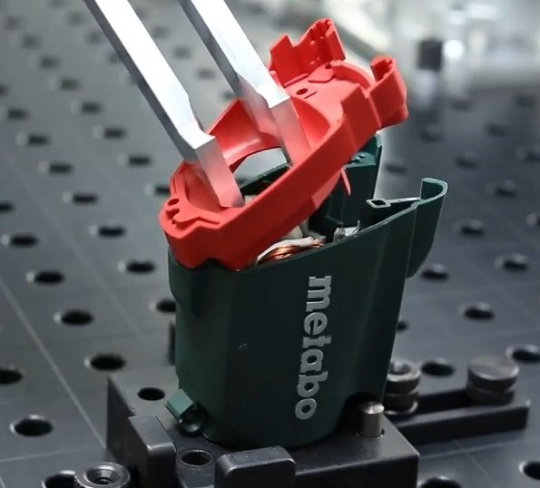

# Skill-based + Force Controlled Robot Control Framework

## Capabilities

- Task-space contrainted based control
- Force control
- Multi-robot control
- Skill & Controller Composition
- Robot-Agnostic (default with Drivers provided by `ROS` but also possible with custom drivers)
- Defintion of programs in a DSL with `xml` syntax

## [Overview](https://www.pitasc.fraunhofer.de/en.html)

*pitasc* is a robot control software mainly intended for force-controlled assembly using collaborative and industrial robots.
It has been utilized to solve numerous real-world applications. Some notable examples are the
[assembly of plastic components](https://www.youtube.com/watch?v=s0nBJR_MGwM) as well as
[riveting, screwing and clipping](https://www.youtube.com/watch?v=1_VV98WQyMI) applications.
*pitasc* also allows for [rapid reconfigurability](https://www.youtube.com/watch?v=XGdiYxBxXGk) of flexible robot cells and the
coordinated control of two robot arms, e.g. for the [automated wiring of electrical cabinets](https://www.youtube.com/watch?v=xXR2FxPVqa4).

*pitasc* follows a *skill*-based programming approach, i.e., robot programs are not programmed in a certain, possibly vendor-specific, programming language.
Instead, the developer arranges and parameterizes so called *skills*. *Skills* can either involve simple commands like LIN and PTP movements or
they can model more complex behaviour, possibly consisting of concurrent position and force control in different task space dimensions.
Real-world applications like the examples above usually necessitate these more sophisticated *skills*.

The middleware is based upon `ROS 1 (Noetic)` right now.

## Videos

## Publications

- F. Nägele, L. Halt, P. Tenbrock and A. Pott, "A Prototype-Based Skill Model for Specifying Robotic Assembly Tasks," 2018 IEEE International Conference on Robotics and Automation (ICRA), Brisbane, QLD, Australia, 2018, pp. 558-565, doi: 10.1109/ICRA.2018.8462885. [link](https://ieeexplore.ieee.org/document/8462885)

## How to get it

Software is closed source for now, so please contact daniel.bargmann@ipa.fraunhofer.de for a copy   