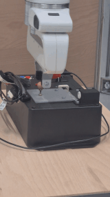
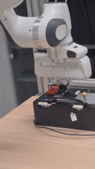
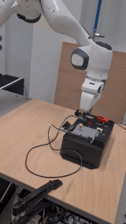
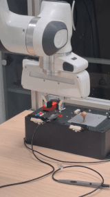
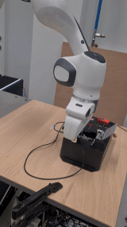
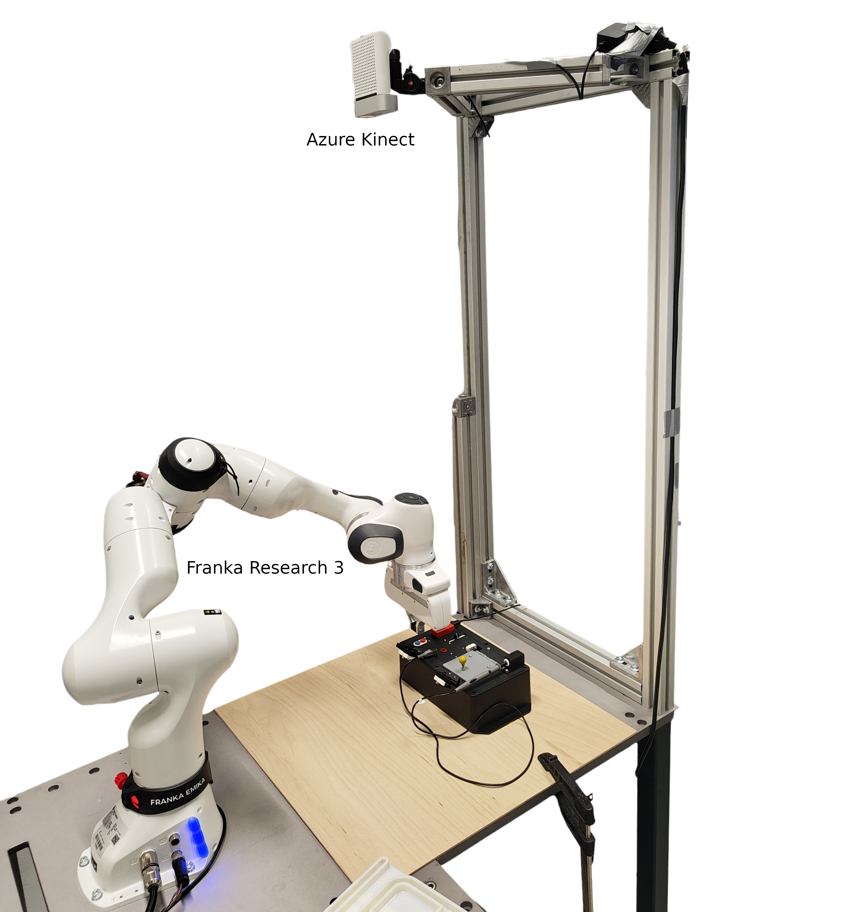

# Learning of skills based on exploiting environmental constraints
**Table of contents:**

- [Solution overview](#solution-overview)
  * [Supported skills](#supported-skills)
- [Requirements](#requirements)
  * [Hardware dependencies](#hardware-dependencies)
  * [Software dependencies](#software-dependencies)
- [How to run](#how-to-run)
- [Solution in-depth description](#solution-in-depth-description)
- [Authors](#authors)

<!-- Generated with http://ecotrust-canada.github.io/markdown-toc/ -->

## Solution overview

A BabyAGI-inspired approach processes initial textual instructions (i.e. task board completion steps) into a robot-executable task list along with a predefined list of valid parameters. 

For vision processing, we will use one of the state-of-the-art open-set segmentation models.

The execution of robotic tasks is partially based on ideas discussed in *M. Simonič, A. Ude and B. Nemec (2024). "Hierarchical learning of robotic contact policies", Robotics and Computer-Integrated Manufacturing, vol. 86, art. 102657,
doi: https://doi.org/10.1016/j.rcim.2023.102657.*

### Supported skills

| Door opening  | Sliding  | Button press | (Un)plugging | Probing | 
| ------------- | -------- |--------------|--------------|---------|
|  |  |  |  | 

## Requirements

### Hardware dependencies

The workcell is based on a modular design described in *P. Radanovič, J. Jereb, I. Kovač and A. Ude. “Design of a Modular Robotic Workcell Platform Enabled by Plug & Produce Connectors,” 2021 20th International Conference on Advanced Robotics (ICAR), Ljubljana, Slovenia, 2021, pp. 304-309, doi: 10.1109/ICAR53236.2021.9659345.*

| Hardware type | Model                            | OS/Driver version                            | Note/Picture                                                                 |
|---------------|----------------------------------|----------------------------------------------|------------------------------------------------------------------------------|
| Robot         | Franka Research 3                | Franka Desk 5.4.0  | [Link to official site](https://franka.de/research)                          |
| Gripper       | Standard Franka gripper          | /                                            |                                                                              |
| Computer      | i7-9700 CPU @ 3.00GHz; 32 GB RAM | Debian GNU Linux 11; 5.10.0-8-rt-amd6 kernel |                                                                              |
| Overhead camera| Azure Kinect                    |                                             | [Link to official site](https://azure.microsoft.com/en-us/products/kinect-dk/)|
| In-hand camera| Intel Realsense D435             |                                             | [Link to official site](https://www.intelrealsense.com/depth-camera-d435)    |

### Software dependencies

The software architecture is based on a modular design described in *M. Simonič, R. Pahič, T. Gašpar, S. Abdolshah, S. Haddadin, M. G. Catalano, F. Wörgötter and A. Ude. “Modular ROS-based software architecture for reconfigurable, Industry 4.0 compatible robotic workcells,” 2021 20th International Conference on Advanced Robotics (ICAR), Ljubljana, Slovenia, 2021, pp. 44-51, doi: 10.1109/ICAR53236.2021.9659378.*

| Name | Version | What | Note  |
|------|---------|------|-------|
| MATLAB | R2022b | programming language | commercial |
| Python | 3.11 | programming language |  
| ROS  | melodic/noetic | Robot Operating System (ROS) 
| Azure Kinect ROS driver | [melodic](https://github.com/microsoft/Azure_Kinect_ROS_Driver.git) | Camera support | third-party                                               |
| Realsense ROS driver | [ros1-legacy](https://github.com/IntelRealSense/realsense-ros/tree/ros1-legacy)) | Camera support | third-party                                               |
| libfranka | 0.10.0 | Franka robot control API | third-party
| Franka Simulink Library |  [0.3.0](https://frankaemika.github.io/docs/franka_matlab) | Simulink libfranka bindings 
| IJS controllers |  [latest](https://repo.ijs.si/hcr/franka/franka_simulink_controllers) | Custom implementation of cartesian impedance controller allowing arbitrary stiffness frames and joint-level friction compensation | internal
| Robot Blockset | [latest](https://repo.ijs.si/leon/robotblockset)  | Robot-agnostic library for robot control | internal |
| Vision module |  TBD | Instance segmentation | internal |
| Action prediction module | TBD | TBD | internal

Docker images can be found in a separate container repository: TBD

## How to run

TBD
<!-- 
The good how to build, run and get started section has:
- [ ] All downloads, setups, clicks, commands and actions needed to run the version listed.
-->

## Solution in-depth description

TBD

<!--
The good how to build, run and get started section has:
- [ ] Descripes the solution and all it's interesting parts a bit more in depth, how it can be modified and what their porpuse is. -->

## Authors

- [Bojan Nemec](https://abr.ijs.si/people/bojan-nemec/)
- [Mihael Simonič](https://abr.ijs.si/people/mihael-simonic/)
- [Boris Kuster](https://abr.ijs.si/people/bojan-nemec/)
