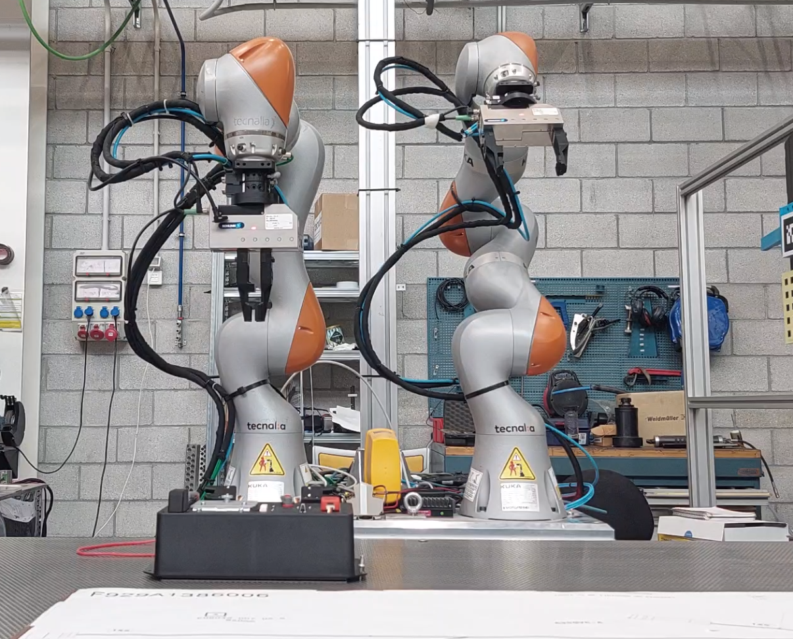

# ROBOUTON

**Table of content:**

- [Solution overview](#solution-overview)
  - [Hardware](#hardware)
  - [Software](#software)
    - [Teaching](#teaching)
- [How to run](#how-to-run)
- [Solution description](#solution-in-dept-description)
- [Authors](#authors)

<small><i><a href='http://ecotrust-canada.github.io/markdown-toc/'>Table of contents generated with markdown-toc</a></i></small>

## Solution overview

We tackled the task-board challenge with the teaching software we developed for the existing european project _Remodel_. The robotic platform used was manufactured by Robotnik alongside Tecnalia, and is also the product an the european project, _Sherlock_, and is now used in many more.

### Hardware

| Hardware type     | Model              | OS/Driver version | Note/Picture                                                                                          |
|-------------------|--------------------|-------------------|-----------------------------------------------------------------------------------------------|
| Robot             | RB-ROBOUT | N/A         | [Link for official site](https://robotnik.eu/products/customization/rb-robout/)                |
| 3D printed finger | Costume made       | N/A                |  |
| Computer          |        |  18.04 / ROS Melodic    |                                                                                               |
| Camera            |   Realsense 435                 |                   |                                                                                               |
| Gripper           | Schunk WSG 50                   |                   | [Link to manual](https://www.google.com/url?sa=t&rct=j&q=&esrc=s&source=web&cd=&cad=rja&uact=8&ved=2ahUKEwjvkrvtj4mAAxXkoVwKHdeECyAQFnoECAcQAQ&url=https%3A%2F%2Fwww.roscomponents.com%2Fes%2Findex.php%3Fcontroller%3Dattachment%26id_attachment%3D215&usg=AOvVaw1075yniJidHvAY9FWFmg_V&opi=89978449)                                                                                              |

### Software

#### Teaching

This is our internal tool for teaching. It is formed by a gui where the user can select which arm and gripper to use and then start recording the trajectory. The robot can be moved with a 6-axis joystick or by hand. At any moment the user can insert a relevant point in the trajectory, where the robot may open a gripper or take a picture. Once the trajectory is recorded it is saved in a database and can be replayed right away.

## How to run

In order to run the solution the user must switch on the robot and launch the teaching software. Then connect to the robout gui service from another device and replay the selected trajectory.

## Solution description

Our solution for the task-board challenge implies reusing software used in other projects. In this case, the teaching tool developed for the remodel project (which in part inspired the cable-routing task) was used to record the robot performing the opening door task and then the cable routing one.

We recorded each task in one tought trajectory. In one side the door opening, then probing the internal circuit and then the cable routing. For the cable routing task we used some pins placed perpendicular to the table to guide the cable and help the robot maintain tension on it.

### Limitations

The main limitation is the inability of the teaching software to offset trajectories. This means that once the trajectory is recorded it can only be performed if the task-board is in the same spot.

Then, although we succesfully completed the cable routing task, its repeatability is not very high and it depends on the initial state of the cable.

## Authors

 Francisco Blanco, [Github](https://github.com/FranBesq)

 Arkaitz Urkiza
