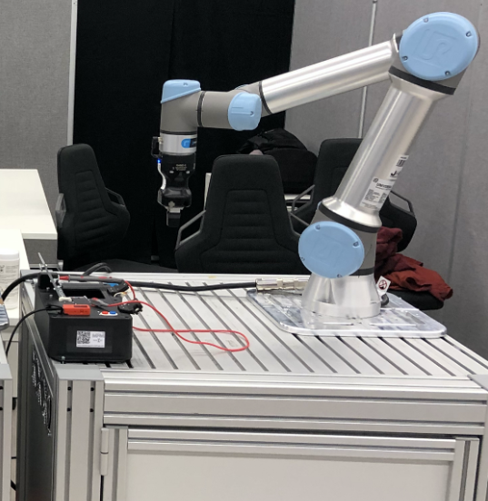
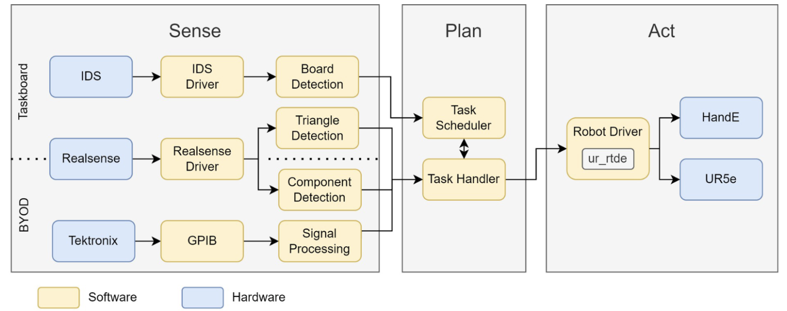

# Electronic Task Board Solution v2023 (TUM)
**Table of content:**
- [Solution overview](#solution-overview)
  * [Hardware dependencies](#hardware-dependencies)
  * [Software dependencies](#software-dependencies)
- [How to run](#how-to-run)
- [How to log data](#how-to-log-data)
- [Citation](#citation)
- [Authors](#authors)


## Solution Overview
This solution is adapted from the winning team from the Robothon 2023 competition RoboPig.

This solution uses a UR5e robot with a Robotiq HAND-E gripper with rubber finger tips driven from a command line interface to solve all 5 tasks on the task board. A 3D printed hook tool is used to by the robot to route the multimeter cable around the wrap posts. The solution can work with a downward facing fixed camera mounted about the robot work area, a camera mounted on the robot wrist, or without a camera and using a 4-point kinesthetic teaching routine prior to running the solution with the robot and task board.

A command line tool is provided to add new robot waypoints to memory. 

A video of the solution can be viewed on [YouTube](https://youtu.be/6Rn9_H7Msdc?si=LZ-QHxw4isQYxyQ9)

A picture of the robot work cell.



A diagram of software and hardware components and their connections.



## Hardware Dependencies

| Hardware type     | Model              | OS/Driver version | Note/Picture                                                                                          |
|-------------------|--------------------|-------------------|-----------------------------------------------------------------------------------------------|
| Robot Arm         | Universal Robots - UR5e | SW 5.13.1         | [Link for official site](https://www.universal-robots.com/products/ur5-robot/)                |
| Cable Hook        | 3D Printed         | N/A               | [Link for STL](./assets/stl/RoboPig_CableHook.stl) |
| Hook Stand        | 3D Printed         | N/A               | [Link for STL](./assets/stl/RoboPig_CableHookHolder.stl) |
| Computer          | ThinkPad T15       | ubuntu 20.04.6    |                                                                                               |
| Camera            | Intel RS D435i     | RS Driver         |                                                                                               |
| Gripper           | Robottiq HAND-E    | UR Cap            |                                                                                               |


## Software Dependencies

### UR5e Pendant Settings
Before attempting to run any programs with the robot, set the system parameters on the teach pendant to match the following:
```
TCP
    X 0mm
    Y 0mm
    Z 148mm

Payload
    with Realsense
        CX 3mm
        CY 2mm
        CZ 50mm
    wihtout Realsense
        CX 0mm
        CY 0mm
        CZ 59mm
```

### How to install dependencies
- ***ROS-Melodic***
https://wiki.ros.org/melodic

- ***opencv***
`pip install opencv-python`

- ***cv_bridge***
`pip install cv-bridge`

- ***numpy***
`pip install numpy`

- ***rospy***
`pip install roslibpy`

- ***json***
`sudo apt install nlohmann-json3-dev`

- ***cgal***
`sudo apt install libcgal-dev`

- ***ur-rtde***
https://sdurobotics.gitlab.io/ur_rtde/installation.html#linux-ubuntu-and-macos

```
git clone https://gitlab.com/sdurobotics/ur_rtde.git
cd ur_rtde
git checkout v1.5.5
git submodule update --init --recursive
mkdir build
cd build
cmake -DCMAKE_INSTALL_PREFIX=/usr ..
make -j
sudo make install
```


## How to run
Run the following commands in the provided order to run the task board demo with the robot.

1. In terminal 1, run `roslaunch robothon2023 taskboard_core.launch`

2. In terminal 2, run `rosrun robothon2023 robothon2023_touch_detect`
    !!Attention!! Robot is immediately aligning to z
        touch so that +y of tcp looks away from task board
        touch longside without cable holder
        touch shortside next to probe
        touch top of the task board
        move robot away
        Confirm position of task board relative to robot in rviz

3. In terminal 2 after the task board waypoints have been taugh with the above command line tool, run `rosrun robothon2023 robothon2023_taskboard`
    !!Warning!! robot will move immediately to the home position


## How to log data
1. uncomment 2x call_log() in task_board_scheduler.cpp

2. change path in task_board_tasks.cpp

After each run change filname in first call_log() in task_board_scheduler.cpp.
This logging solution will be improved to use the current date timestamp to avoid this step in the future.


## Citation
Kranz, Philipp & Ali, Usama & Mueller, Adrian & Hornauer, Maximilian & Loeser, Martin & Sukkar, Fouad & Willert, Volker & Kaupp, Tobias. (2023). Towards Recycling E-Waste Using Vision and Robotic Manipulation. [ResearchGate](https://www.researchgate.net/publication/376267145_Towards_Recycling_E-Waste_Using_Vision_and_Robotic_Manipulation)

## Authors
Peter So, [Github](https://github.com/peterso/), [LinkedIn](https://www.linkedin.com/in/peterso/), [peter.so@tum.de](mailto:peter.so@tum.de)
